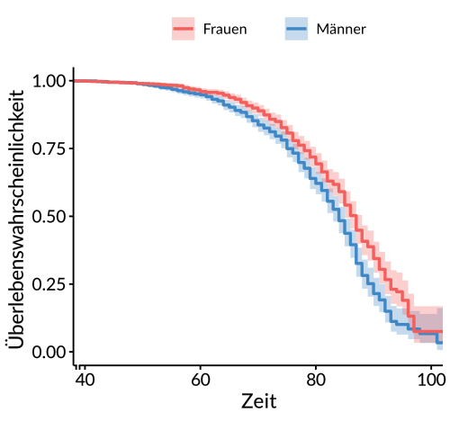
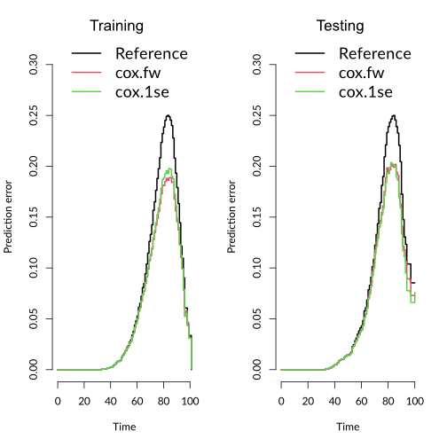

# Erläuterung relevanter Konzepte

1. [Überlebenszeitanalyse](#Überlebenszeitanalyse)
   1. [Cox-Regression](#cox-regression--cox-proportional-hazards-modell)
   1. [Zensierte Daten / Zensierung](#zensierte-daten)
   1. [Kaplan-Meier-Schätzer](#kaplan-meier-schätzer)
   1. [Gefährdungsrate / Hazard-Rate](#gefährdungsrate--hazard-rate)
1. [Gütemaße](#gütemaße)
   1. [Brier-Score](#Brier-Score)
   1. [Concordance-Index (C-Index)](#C-Index)
   1. [Log-Rank-Test](#log-rank-test)
1. [Sonstige Konzepte](#sonstige-konzepte)
   1. [Imputation durch Predictive Mean Matching](#predictive-mean-matching-imputation)

## Überlebenszeitanalyse

Eine Überlebenszeitanalyse ist ein statistisches Verfahren, das darauf abzielt, die Zeit bis zum Eintritt eines bestimmten Ereignisses zu untersuchen. In unserem Fall der Eintritt des Todes. Im Gegensatz zu herkömmlichen Verfahren, die oft auf binären Outcomes (Ereignis eingetreten/nicht eingetreten) basieren, berücksichtigt die Überlebenszeitanalyse explizit den Zeitfaktor bis zum Eintritt des Ereignisses.
Ein Schlüsselmerkmal der Überlebenszeitanalyse ist der Umgang mit sogenannten [zensierten Daten](#zensierte-daten). Zensierung tritt auf, wenn die Beobachtung eines Ereignisses zum Ende der Studie hin noch nicht eingetreten ist oder aus anderen Gründen nicht vollständig beobachtet werden konnte. Die Überlebenszeitanalyse ermöglicht es uns, solche unvollständigen Informationen sinnvoll zu nutzen, ohne sie einfach aus der Analyse auszuschließen.

### Cox-Regression / Cox-Proportional-Hazards-Modell

Die Cox-Regression, auch bekannt als proportionales Hazard-Modell, ist eine der am häufigsten verwendeten Techniken in der Überlebenszeitanalyse. Sie ermöglicht es, den Einfluss von erklärenden Variablen (wie Alter, Geschlecht, Gesundheit) auf die Überlebenszeit zu schätzen, ohne dass die zugrunde liegende Zeitverteilung spezifiziert werden muss. Das Modell geht davon aus, dass die Effekte der Kovariaten sich proportional auf die Hazard-Rate, also die sofortige Ereignisrate zu jedem Zeitpunkt, auswirken.
Die Überlebenszeitanalyse ermöglicht also nicht nur die Untersuchung, ob und wann Ereignisse eintreten, sondern auch die Identifikation und Quantifizierung von Faktoren, die diese Zeiten beeinflussen.

### Zensierte Daten

In der Überlebenszeitanalyse bezeichnet man Daten als zensiert (engl. "censored"), wenn die Information über das Eintreten des Ereignisses von Interesse (z.B. Tod, Krankheitsrückfall, Geräteausfall) für einige Studienteilnehmer am Ende der Beobachtungsperiode noch nicht vorliegt. Es gibt verschiedene Arten der Zensierung:

- **Rechtszensierung:** Das Ereignis ist bis zum Studienende nicht eingetreten, oder der Teilnehmer hat die Studie vorzeitig verlassen. Dies ist die häufigste Form der Zensierung, wie auch im Fall der vorliegenden Studie.
- **Linkszensierung:** Das Ereignis ist bereits vor Beginn der Studie eingetreten.
- **Intervallzensierung:** Bekannt ist nur, dass das Ereignis in einem bestimmten Zeitintervall eingetreten ist.

Die Berücksichtigung zensierter Daten ist aus mehreren Gründen wichtig:
- **Informationserhalt:** Viele Teilnehmer haben eventuell das Ereignis bis zum Ende der Studie nicht erlebt. Ihre Daten bis zu diesem Zeitpunkt sind immer noch wertvoll und liefern Informationen über das Überleben bis zu diesem Punkt.
- **Verzerrung vermeiden:** Würde man nur die Ereignisse berücksichtigen und zensierte Fälle ignorieren, würde das zu einer systematischen Verzerrung der Ergebnisse führen. Die Schätzungen würden die Überlebenszeit unterschätzen, da man fälschlicherweise annimmt, dass alle nicht beobachteten Ereignisse eine kürzere Überlebenszeit haben.
- **Statistische Effizienz:** Das Ausschließen zensierter Daten führt zum Verlust von Informationen und damit zu einer geringeren statistischen Effizienz. Die verfügbaren Daten werden nicht vollständig genutzt, was zu weniger präzisen Schätzungen führt.

Die normale lineare Regression oder andere Regressionsmodelle sind für die Analyse von Überlebenszeiten nicht geeignet, da sie die Zensierung nicht berücksichtigen. Sie setzen voraus, dass für alle Beobachtungen vollständige Informationen vorliegen. Überlebenszeitanalysen, wie die [Cox-Regression](#cox-regression), sind speziell dafür entwickelt worden, um mit zensierten Daten umzugehen und die Wahrscheinlichkeit des Eintretens eines Ereignisses über die Zeit zu modellieren. Sie erlauben es, die Daten aller Teilnehmer zu nutzen, sowohl derjenigen, bei denen das Ereignis eingetreten ist, als auch derjenigen, bei denen es nicht eingetreten ist. Dadurch erhält man eine genauere und weniger verzerrte Schätzung der Überlebensfunktion und des Einflusses von Kovariaten auf die Überlebenszeit.

### Kaplan-Meier-Schätzer
Der Kaplan-Meier-Schätzer ist eine statistische Methode, die in der Überlebenszeitanalyse verwendet wird, um die Wahrscheinlichkeit des Überlebens über die Zeit zu schätzen. Diese Methode ist besonders nützlich, wenn die Überlebensdaten zensiert sind, d.h., wenn für einige Studienteilnehmer das interessierende Ereignis (wie Tod oder Rückfall) am Ende der Beobachtungsperiode noch nicht eingetreten ist.

#### Grundprinzipien

- **Schätzung der Überlebensfunktion**: Der Kaplan-Meier-Schätzer berechnet die Wahrscheinlichkeit, dass ein Individuum über einen bestimmten Zeitraum hinweg überlebt. Die Überlebensfunktion wird Schritt für Schritt zu jedem Zeitpunkt berechnet, zu dem ein Ereignis (z.B. Tod) auftritt.

- **Berücksichtigung von zensierten Daten**: Die Methode berücksichtigt zensierte Daten, indem sie nur die verfügbaren Informationen bis zum Zeitpunkt der Zensierung eines Individuums verwendet. Zensierte Daten werden nicht als Ereignisse gezählt, aber sie tragen zur Anzahl der Personen bei, die bis zu ihrem Zensierungszeitpunkt überlebt haben.

#### Berechnung

Die Kaplan-Meier-Überlebensfunktion \( S(t) \) wird zu verschiedenen Zeitpunkten \( t \) berechnet, an denen Ereignisse aufgetreten sind. Die Formel lautet:

`S(t) = Π(i: ti ≤ t) (1 - di/ni)`

wobei \( di \) die Anzahl der Ereignisse zum Zeitpunkt \( ti \) und \( ni \) die Anzahl der bis zu diesem Zeitpunkt überlebenden Individuen ist.

#### Anwendung

- **Graphische Darstellung**: Die Ergebnisse des Kaplan-Meier-Schätzers werden häufig in Form einer Kurve dargestellt, die zeigt, wie die Überlebenswahrscheinlichkeit im Laufe der Zeit abnimmt.

- **Vergleich von Gruppen**: Der Kaplan-Meier-Schätzer kann verwendet werden, um die Überlebensfunktionen verschiedener Gruppen zu vergleichen, z.B. unterschiedliche Behandlungsgruppen in klinischen Studien oder Geschlechter.

#### Einschränkungen

- **Annahme unveränderlicher Ereignisraten**: Der Kaplan-Meier-Schätzer geht davon aus, dass die Ereignisraten zwischen den Zeitpunkten konstant sind, was nicht immer der Fall sein muss.

- **Keine Berücksichtigung von Kovariaten**: Der Kaplan-Meier-Schätzer allein berücksichtigt keine Kovariaten oder individuelle Charakteristika. Für solche Analysen werden weiterführende Methoden wie das Cox-Proportional-Hazards-Modell benötigt.

### Gefährdungsrate / Hazard-Rate
In der Überlebenszeitanalyse bezieht sich die Hazard-Rate (auch Gefährdungsrate oder Ausfallrate genannt) auf die Rate, mit der Ereignisse in einer bestimmten Zeiteinheit auftreten, gegeben, dass die Teilnehmer bis zu diesem Zeitpunkt überlebt haben. Es ist ein Konzept, das genutzt wird, um zu beschreiben, wie schnell oder langsam Ereignisse wie Tod, Krankheitsrezidive oder Maschinenausfälle über die Zeit auftreten.

Die Hazard-Rate kann folgendermaßen verstanden werden:

- Sie ist eine Funktion der Zeit und gibt die sofortige Ereigniswahrscheinlichkeit zu jedem Zeitpunkt an, unter der Bedingung, dass das Ereignis bis zu diesem Zeitpunkt nicht eingetreten ist.
- Die Hazard-Rate ist nicht direkt beobachtbar, sondern wird üblicherweise durch statistische Modelle geschätzt.
- Sie kann im Zeitverlauf konstant, steigend, fallend oder auf andere Weise variabel sein, je nach den Eigenschaften der Daten und des untersuchten Phänomens.

In der Praxis wird die Hazard-Rate oft mit Hilfe von Modellen wie dem [Cox-Proportional-Hazards-Modell](#cox-regression--cox-proportional-hazards-modell) analysiert, welches die Beziehung zwischen der Hazard-Rate und einer oder mehreren unabhängigen Variablen (wie Alter, Geschlecht, Behandlungsmethoden) untersucht.

Ein wichtiger Aspekt der Hazard-Rate ist, dass sie anders als die Wahrscheinlichkeit des Überlebens interpretiert wird. Während die Überlebensfunktion die Wahrscheinlichkeit angibt, bis zu einem bestimmten Zeitpunkt zu überleben, beschreibt die Hazard-Rate die Intensität oder das Risiko eines Ereignisses zum gleichen Zeitpunkt.

## Gütemaße

### Brier Score
Der Brier-Score ist ein Maß für die Genauigkeit von prognostischen Modellen und wird in der Statistik verwendet, um die Vorhersagegenauigkeit von Wahrscheinlichkeitsvorhersagen zu bewerten. Ursprünglich wurde der Brier-Score für Wettervorhersagen entwickelt, aber seine Anwendung wurde auf viele Bereiche erweitert, einschließlich der Überlebenszeitanalyse in der medizinischen Statistik und Epidemiologie.

Der Brier-Score ist definiert als der mittlere quadratische Vorhersagefehler und misst die Abweichung zwischen den beobachteten Ereignissen und den vorhergesagten Wahrscheinlichkeiten des Eintretens dieser Ereignisse über alle Beobachtungen hinweg. Die Formel lautet:

`Brier-Score = 1/N * sum((oi - pi)^2)`

wobei:
- `N` die Anzahl der Beobachtungen ist,
- `oi` der beobachtete Status ist (0 wenn kein Ereignis eingetreten ist, 1 wenn ein Ereignis eingetreten ist),
- `pi` die vorhergesagte Wahrscheinlichkeit des Ereignisses für die Beobachtung `i` ist.

Ein niedriger Brier-Score deutet auf eine hohe Vorhersagegenauigkeit hin, während ein hoher Wert auf eine schlechte Vorhersagegenauigkeit hindeutet. Der Score kann Werte zwischen 0 und 1 annehmen, wobei 0 eine perfekte Vorhersage und 1 die schlechtestmögliche Vorhersage darstellt.

In der Überlebenszeitanalyse ist der Brier-Score besonders nützlich, weil er sowohl die Aspekte der Kalibrierung als auch der Diskriminierung eines Modells berücksichtigt:

- **Kalibrierung** bezieht sich darauf, wie nah die vorhergesagten Wahrscheinlichkeiten im Durchschnitt an den tatsächlichen Wahrscheinlichkeiten liegen.
- **Diskriminierung** bezieht sich darauf, wie gut das Modell zwischen denjenigen differenzieren kann, bei denen ein Ereignis eintritt und denjenigen, bei denen dies nicht der Fall ist.

Der Brier-Score ist besonders vorteilhaft für die Bewertung von Überlebenszeitmodellen, weil er auch bei zensierten Daten angewendet werden kann, indem man die Vorhersagen bis zum Zeitpunkt der Zensierung berücksichtigt. Darüber hinaus ist er einfach zu interpretieren und liefert ein einheitliches Maß für die Vorhersagequalität, das unabhängig vom gewählten Modell ist.

#### Referenzlinie im Brier-Score
Die Referenzlinie in einer grafischen Darstellung des Brier-Scores dient als Benchmark, mit der die Leistung eines prognostischen Modells verglichen wird. Diese Referenzlinie repräsentiert typischerweise den Brier-Score eines naiven oder Basismodells, das keine Informationen über die Prädiktoren nutzt, sondern nur die beobachteten Häufigkeiten der Ereignisse.

In anderen Worten, die Referenzlinie gibt an, was man erwarten würde, wenn man keinerlei Wissen über die individuellen Unterschiede innerhalb der Studienpopulation hätte und ermöglicht es somit, den relativen Wert des eigentlichen Vorhersagemodells einzuschätzen.

### C-Index
Der C-Index, oder Concordance Index, ist ein Bewertungsmaß, das angibt, wie gut ein prognostisches Modell die Reihenfolge von Ereignissen vorhersagen kann. Es wird insbesondere in der Überlebenszeitanalyse verwendet, um die Leistung von Risikomodellen zu beurteilen.

Der C-Index reflektiert die Wahrscheinlichkeit, dass von zwei zufällig gewählten Individuen dasjenige, welches früher ein Ereignis erlebt (z.B. Tod, Maschinenausfall), vom Modell auch ein höheres Risiko zugewiesen bekommt. Der Wertebereich des C-Indexes liegt zwischen 0,5 und 1:

- Ein C-Index von 0,5 bedeutet, dass das Modell nicht besser als Zufall ist; es gibt keine prognostische Unterscheidung zwischen den Fällen.
- Ein C-Index von 1 bedeutet perfekte Übereinstimmung zwischen den Vorhersagen des Modells und den tatsächlichen Ereignissen.

Ein C-Index in der Nähe von 1 weist auf ein Modell mit hoher Vorhersagekraft hin, während ein Wert nahe 0,5 auf ein nicht aussagekräftiges Modell hindeutet.

Der C-Index ist besonders nützlich für die Bewertung der Anpassungsgüte von Überlebenszeitanalysemodellen aus folgenden Gründen:

1. **Berücksichtigung von Zensierung**: Der C-Index kann auch dann angewendet werden, wenn die Daten zensiert sind, was häufig in der Überlebenszeitanalyse der Fall ist, da nicht immer bekannt ist, wann genau ein Ereignis eintreten wird.

2. **Nicht-Parametrisch**: Er hängt nicht von der spezifischen mathematischen Form des Risikomodells ab, was ihn zu einem flexiblen Werkzeug macht, das für eine breite Palette von Modellen anwendbar ist.

3. **Diskriminierungsfähigkeit**: Der Index gibt an, wie gut das Modell in der Lage ist, zwischen Individuen mit unterschiedlichem Risiko zu unterscheiden, was für die klinische Entscheidungsfindung und Patientenselektion wichtig sein kann.

Zusammengefasst ist der C-Index ein robustes und aussagekräftiges Maß für die Qualität eines Überlebenszeitmodells und wird daher oft herangezogen, um die Güte verschiedener Modelle zu vergleichen und das optimale Modell für die Prognose auszuwählen.

### Log-Rank-Test
Der Log-Rank-Test ist ein statistisches Verfahren, das in der Überlebenszeitanalyse eingesetzt wird, um zu überprüfen, ob es signifikante Unterschiede in den Überlebenszeiten zwischen zwei oder mehr Gruppen gibt. Er wird häufig verwendet, um die Wirksamkeit von Behandlungen in klinischen Studien oder den Einfluss von Risikofaktoren in epidemiologischen Studien zu bewerten.

Grundprinzipien des Log-Rank-Tests:

- **Vergleich von Überlebenskurven:** Der Log-Rank-Test vergleicht die Überlebenskurven verschiedener Gruppen, die durch Methoden wie den Kaplan-Meier-Schätzer ermittelt wurden.

- **Annahme:** Der Test basiert auf der Annahme, dass die Hazard-Raten in den verglichenen Gruppen über die Zeit proportional sind, was bedeutet, dass die Unterschiede zwischen den Gruppen im Hinblick auf das Risiko eines Ereignisses (z.B. Tod) über die Zeit konstant bleiben.

- **Berechnung:** Der Test berechnet die beobachteten und erwarteten Ereignisanzahlen in jeder Gruppe zu jedem Zeitpunkt, an dem ein Ereignis auftritt, und vergleicht diese über alle Ereigniszeiten. Die Teststatistik folgt unter der Nullhypothese (kein Unterschied zwischen den Gruppen) einer Chi-Quadrat-Verteilung.

- **Nullhypothese:** Die Nullhypothese des Log-Rank-Tests besagt, dass es keinen Unterschied in den Überlebenszeiten zwischen den Gruppen gibt. Ein signifikantes Testergebnis (typischerweise p < 0,05) deutet darauf hin, dass mindestens eine Gruppe eine andere Überlebenszeit als die anderen Gruppen aufweist.

Der Log-Rank-Test ist besonders nützlich, da er zensierte Daten berücksichtigt und somit in vielen realen Studienszenarien anwendbar ist, in denen nicht alle Teilnehmer ein Ereignis erleben oder die Studie vorzeitig verlassen. Dadurch ist er ein wesentliches Werkzeug in der medizinischen Forschung und anderen Bereichen, in denen die Überlebenszeitanalyse relevant ist.

# Sonstige Konzepte

## Predictive Mean Matching Imputation

Predictive Mean Matching (PMM) ist ein Verfahren zur Imputation fehlender Daten, das besonders in statistischen Analysen angewandt wird. Es ist ein nichtparametrisches Imputationsverfahren, das eine sinnvolle Ergänzung fehlender Werte ermöglicht, ohne dabei auf starke Verteilungsannahmen angewiesen zu sein.

Bei PMM wird für jeden Fall mit fehlenden Daten zunächst ein vorläufiger Imputationswert basierend auf einem Regressionsmodell berechnet. Dieser Wert dient als Grundlage, um eine Reihe von "Spenderfällen" zu identifizieren – das sind Fälle aus dem Datensatz, die keine fehlenden Werte aufweisen und deren vorhergesagte Werte dem vorläufig imputierten Wert ähnlich sind. Anschließend wird aus diesen Spenderfällen zufällig ein Wert ausgewählt und als Imputation für den fehlenden Wert verwendet.

Der Vorteil von PMM liegt darin, dass es die Struktur der beobachteten Daten berücksichtigt und realistische Imputationen liefert. Dieses Verfahren ist besonders nützlich, wenn die Daten ungleichmäßig verteilt sind oder wenn die Normalverteilungsannahme nicht erfüllt ist. PMM bewahrt die ursprünglichen Verteilungs- und Varianz-Eigenschaften der Daten besser als andere Imputationsmethoden, wie zum Beispiel die einfache Mittelwertersetzung.