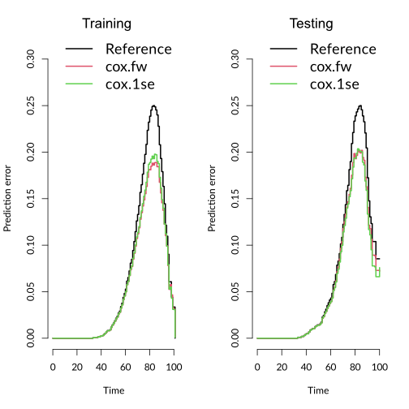

# Überlebenszeitanalyse des MIDUS Datensatzes

* [Projektbeschreibung](#projektbeschreibung)

* [Wichtige Konzepte erklärt](concepts.md)

* [Zusatzmaterial](supplementary.md)

* [Referenzen und Literatur](references.md)

* [Kontakt](#kontakt)

[ Plakat herunterladen](_include/poster.pdf)

# Projektbeschreibung

Unser Forschungsziel war es, die Einflüsse von psychologischen Faktoren auf die Lebensdauer zu untersuchen und mit anderen Einflüssen zu vergleichen. Dafür setzten wir die Methode der [Überlebenszeitanalyse](concepts.md#überlebenszeitanalyse) ein, konkret in Form einer [Cox-Regression](concepts.md#cox-regression--cox-proportional-hazards-modell). Dieses Verfahren ermöglichte es uns, alle verfügbaren Daten effektiv zu nutzen – auch wenn etwa zwei Drittel unserer Beobachtungen noch kein Todesereignis aufwiesen.

1. [Datensatz](#datensatz)
   1. [Vorauswahl der Variablen](#vorauswahl-der-variablen)
   1. [Elastic Net Regularisierung](#elastic-net-regularisierung)
1. [Modellvalidierung](#modellvalidierung)
   1. [Robustheit der Prädiktorauswahl](#robustheit-der-prädiktorauswahl)
   1. [Feature Selection: E-Net vs. Forward Selection](#feature-selection-elastic-net-vs-forward-slection)
1. [Erkenntnisse](#erkenntnisse)
1. [Stärken](#stärken)
1. [Limitationen](#limitationen)

## Datensatz

Über die Daten der ersten Welle aus dem [MIDUS-Projekt](https://midus.wisc.edu/) standen uns 2098 Variablen von 7108 Beobachtungen zur Verfügung. Für jede Beobachtung liegt bis 2023 zusätzlich die Information vor ob und wann die befragte Person gestorben ist. 
Von den Beobachtungen mussten 3 ausgeschlossen werden, weil eine Angabe zum Geburtsjahr fehlte (n = 7105).

In unseren ersten Analysen zeigte sich das Geschlecht konstant als starker Prädiktor und bestätigte damit die zahllosen Vorbefunde, dass Männer im Schnitt kürzer leben als Frauen. Das brachte uns auf die Idee separate Modelle für Männer und Frauen zu schätzen, um tiefere Einblicke in die geschlechtsspezifischen Unterschiede zu gewinnen.

Die methodische Herangehensweise umfasste sowohl äußere als auch innere Kreuzvalidierungsschleifen. Dadurch mussten wir nach dem etwa 50/50 Split für die Geschlechter noch zwei weitere Aufteilungen der Daten in 70/30 Splits vornehmen. Infolgedessen basierten unsere Schätzungen jeweils auf 500 bis 600 Ereignissen. Um ein ausgewogenes Verhältnis zwischen der Anzahl der Prädiktoren und der beobachteten Ereignisse zu gewährleisten, reduzierten wir die ursprünglich über 2000 Variablen erheblich.

*Aufgrund des Designs stehen zur Schätzung der eigentlichen Modelle nur noch rund 500 bis 600 Ereignisse zur Verfügung. Das Verhältnis von Prädiktoren zu Ereignissen sollte nicht über 1:10 liegen.*

### Vorauswahl der Variablen

Variablen mit einem Anteil von mehr als 15 % fehlenden Werten oder einer Varianz nahe 0, wurden ausgeschlossen. Die verbleibenden 787 Variablen wurden, wenn sinnvoll, zu Skalen zusammengefasst (287) oder ausgeschlossen, wenn sie keine aussagekräftigen (z.B. ID) oder redundante Information über die Beobachtung enthalten. Kategoriale Variablen mit mehr als 2 Ausprägungen, wurden kontinuierlich interpretiert, wenn die Abstufungen dies zuließen, oder in dichotome Variablen umkodiert. Für die Analyse standen so dann noch 182 Prädiktoren für die 2 abhängigen Variablen zur Verfügung.

### Elastic Net Regularisierung

Mithilfe einer Elastic Net Regularisierung wurde die finale Auswahl der Prädiktoren algorithmisch für die [Cox Regression](concepts.md#cox-regression--cox-proportional-hazards-modell) bestimmt. Der Alpha-Hyperparameter wurde anhand mehrere äußerer Validierungsschleifen ermittelt und dann statisch festgelegt (α = .05), während Lambda über 5 innere Kreuzvalidierungsschleifen für jeden spezifischen Datensatz optimiert wurde. 
Für die Männer wurden so 31 und für die Frauen 52 aus 182 Prädiktoren ausgewählt.

*__Lambda Tuning für die 3. äußere Schleife der Männer.__ 
Der linke Plot illustriert die Verschiebung der Gewichte abhängig von Log(Lambda), wobei mit größerem Lambda mehr und mehr Variablen auf null gedrückt werden.* 
*Der rechte Plott zeigt die Modell-Anpassungsgüte anhand des [C-Index](concepts.md#c-index) abhängig von Log(Lambda). Statt dem Wert mit dem kleinsten Kreuzvalidierungsfehler (linke vertikale gestrichelte Linie), wird der Wert um einen Standardfehler verschoben gewählt (1-SE-Regel), um ein etwas sparsameres Modell zu erhalten und die Gefahr für Overfit zu verringern.*

Auf diese Weise haben wir gleichzeitig die Gefahr für Multikollinearität reduziert, da die Elastic-Net-Regularisierung einen Großteil der Variablen ausschließt und sich eher für eine von hochkorrelierten Variablen entscheidet (Schreiber-Gregory, 2018).

*Der plot zeigt alle Variablen (von 182) die über +/- .8 miteinander korrelieren.*  
*Wir stellen fest, dass die Variablenpaare nicht gemeinsam in Modellen erscheinen* 
*\* wurde in keinem Modell ausgewählt*

### Imputation und Standardisierung

Fehlende Werte imputierten wir in den äußeren Kreuzvalidierungsschleifen mithilfe von [Predictive Mean Matching](concepts.md#predictive-mean-matching-imputation). Kategoriale Variablen wurden dichotomisiert oder, wo zulässig, kontinuierlich interpretiert. Alle kontinuierlichen Variablen haben wir z-standardisiert.

## Modellvalidierung

Zur Bewertung der Anpassungsgüte wurde für jedes Modell der [Concordance-Index (C-Index)](concepts.md#c-index) verwendet (lag zwischen .64 bis .71). Zusätzlich wurden 5 äußere Validierungsschleifen durchlaufen, um die Robustheit der Vorhersagegüte sowie der Prädiktorauswahl und -gewichtung zu bestimmen.

Für die Vorhersagegüte berechneten wir die [Brier-Scores](concepts.md#brier-score) der Modelle und mittelten diese über alle äußeren Loops. Sie zeigten eine leichte Reduktion des Vorhersagefehlers im Vergleich zum Null-Modell.

### Robustheit der Prädiktorauswahl

Es fiel uns auf, dass sich die spezifische Prädiktorenauswahl zwischen den Modellen stark unterschied, obwohl viele Prädiktoren regelmäßig in den Modellen auftauchten. Es gab keine überraschenden Abweichungen, wenn Prädiktoren in verschiedenen Modellen ausgewählt wurden.

 

*Für eine Detailansicht die Grafik anklicken.* 
*Die Plots zeigen nur Prädiktoren, die in mindestens einem der 5 Modelle ein signifikant von 0 verschiedenes Gewicht aufwiesen.*

### Feature-Selection: Elastic Net vs. Forward Selection

Für jede innere Schleife haben wir zwei Auswahlverfahren für die Prädiktoren verglichen. Zum einen die Auswahl per Elastic Net und zum anderen die Auswahl durch Forward Selection. Letztere Methode fügt nach und nach, der Variable Importance folgend, Prädiktoren in das Modell ein und prüft ob sich der Modellfit verbessert. 

Unsere Tests zeigen keinen nennenswerten Unterschied zwischen den beiden Verfahren.

*[Brier-Scores](concepts.md#brier-score) für Trainings- und Testdatensatz* 
*cox.fw = Forward Selection 
cox.1se = Elastic Net mit λ nach [1-SE-Regel](#elastic-net-regularisierung) ausgewählt 
Hier beispielhaft für die Männer in der 1. äußeren Schleife*

## Erkenntnisse

* Psychologische Variablen wurden kaum ausgewählt und hatten wenig Einfluss.
   * Interessant ist, dass erstmal positive Konstrukte wie Lebenszufriedenheit oder Altruismus offenbar Risikofaktoren darstellen.
   * Männer und Frauen unterscheiden sich in den relevanten Risikofaktoren. 
   Für Frauen spielen offenbar Beziehungsbezogene Variablen eine größere Rolle als für Männer (z.B. Hilfe für Familie), während bei Männern eher selbstbezogene Variablen relevant sind (z.B. Lebenszufriedenheit)

* Elastic Net Regularisierung führt im vorliegenden Fall nicht zu einer besseren Auswahl von Prediktoren als Forward Selection

## Stärken

* Direkter Vergleich von psychologischen Variablen mit einer großen Bandbreite anderer.
* Überlebenszeitanalyse berücksichtigt zensierte Daten
* Äußere Kreuzvalidierung zur Bewertung der Prädiktorauswahlkonsistenz und Modellvorhersagegenauigkeit
* Machine Learning getriebene Prädiktorauswahl

## Limitationen

* Psychologische Variablen im Datensatz begrenzen sich auf Persönlichkeitsmerkmale und viele "fuzzy" Konstrukte wie Lebenszufriedenheit
   * Pathologische Variablen wie Depressivität oder Suizidalität würden möglicherweise bedeutendere Informationen liefern
* Die Güte der Modelle könnte wahrscheinlich etwas verbessert werden, indem man multiple Imputation und mehr Kreuzvalidierungsschleifen verwendet. Außerdem könnte Alpha ebenfalls optimiert werden.
* Insgesamt lässt sich die Überlebenswahrscheinlichkeit nicht sehr präzise anhand des Datensatzes schätzen
* Bei der Entscheidung welche Variablen redundante Informationen enthalten könnte man auch stärker anhand von Kovarianzen vorgehen. Prinzipiell sollte hier aber die Elastic-Net-Regularisierung ohnehin gegensteuern.

# Kontakt
### Verfasser
* Alan Hernes (EMAILADRESSE)
* Jonas Walter (EMAILADRESSE)

### Betreuung
* Prof. Dr. Ulrich Schroeders 
https://www.uni-kassel.de/fb01/institute/institut-fuer-psychologie/fachgebiete/psychologische-diagnostik/prof-dr-ulrich-schroeders

#### Danksagung
Herzlichen Dank an Kristin Jankowsky und Prof. Dr. Ulrich Schroeders für wichtige Wegweiser, Inspiration sowie die Betreuung dieses Projekts.