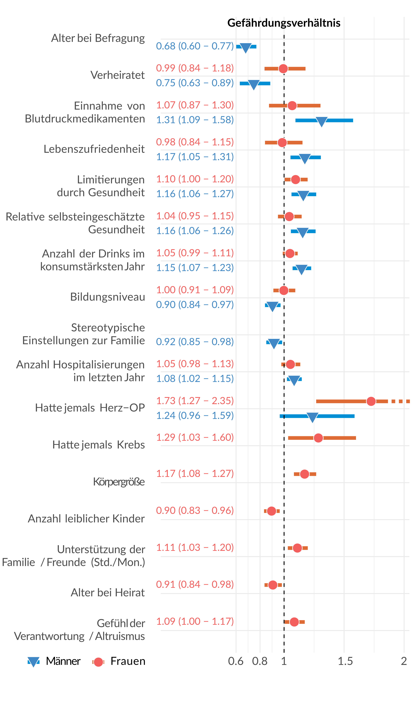

## Code

Der Datensatz des MIDUS-Projekts muss separat bezogen werden.
https://www.midus.wisc.edu/data/index.php

### Der R-Code zur Analyse
* Überlebenszeitanalyse | [survival_analysis.R](jonas/survival_analysis.R)
* Forestploterzeugung | [survival_analysis_combined.R](jonas/survival_analysis_combined.R)
* Datenaufbereitung, Schritt 1 | [data_filtered.R](jonas/data_filtered.R)
* Datenaufbereitung, Schritt 2 | [create_final_dataset.R](alan/create_final_dataset.R)

### Variablenauswahl Tabelle
* Variablenübersicht | [MIDUS_variable_categories.xlsx](alan/MIDUS_variable_categories.xlsx)

## Output

### Outputs der einzelnen Durchläufe
* Gesamtstichprobe | [all_v1](jonas/output/all_v1/)
* Frauenstichprobe | [female_v1](jonas/output/female_v1/)
* Männerstichprobe | [male_v1](jonas/output/male_v1/)

### Übersichtsplots
* Frauen, alle 5 Schleifen | [_forestplot_females.pdf](_include/_forestplot_females.pdf)
* Männer, alle 5 Schleifen | [_forestplot_males.pdf](_include/_forestplot_females.pdf)

### Plots des Plakats und der Beschreibungen
* Ordner der Grafiken | [_include](_include/)

